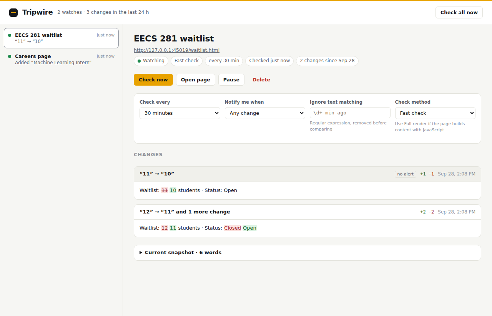
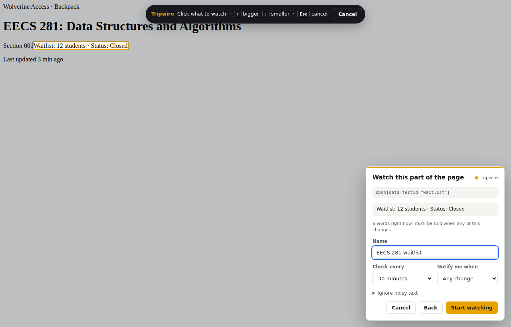
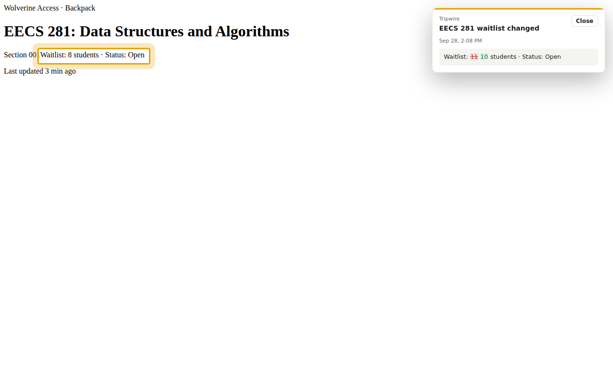

# Tripwire

A Chrome extension that watches any part of any web page and tells you, word by word, what changed.

Pick a course waitlist, a job board, a price, or a grades portal. Tripwire checks it in the background and sends a desktop notification like **“12” → “11” and 1 more change** the moment it changes. Clicking the notification opens the page, scrolls to the element, and shows the diff on top of the live page.



## Features

- **Point-and-click picker.** Hover to highlight, click to choose. Press <kbd>↑</kbd> / <kbd>↓</kbd> to grow or shrink the selection to its parent or child.
- **Word-level diffs.** Every change is stored with what was added and removed, not just “something changed”.
- **Works on JavaScript-heavy sites.** Tripwire detects pages that build their content with JavaScript (Workday, Canvas, most single-page apps) and switches to a full-render check automatically.
- **Notify rules.** Get alerted on any change, only when some text *appears* (“Open”, “In stock”), or when it *disappears* (“Waitlist full”).
- **Noise filters.** Regular expressions such as `\d+ min ago` are stripped before comparing, so timestamps and view counters don't cause false alerts.
- **Handles pages that go wrong.** You get one warning if the element disappears, and another after three failed checks in a row.
- **Private by design.** There are no servers or accounts, and all data stays in `chrome.storage.local`. Site access is requested per site, only when you add a watch there.

| Picking an element | Notification click-through |
|---|---|
|  |  |

## Install

1. Download or clone this repo.
2. Open `chrome://extensions` and turn on **Developer mode**.
3. Click **Load unpacked** and select the folder.
4. Pin Tripwire, open any site, click the icon (or press <kbd>Alt</kbd>+<kbd>Shift</kbd>+<kbd>W</kbd>), and choose **Watch part of this page**.

## How it works

```
popup ──inject──▶ picker.js (shadow DOM overlay) ──addWatch──▶ background.js (service worker)
                                                                  │
                         chrome.alarms (one per watch) ───────────┤
                                                                  ▼
                                      ┌──────── fast check ────────┐   ┌──── full render ────┐
                                      │ fetch() ─▶ offscreen doc   │   │ background tab ─▶   │
                                      │ DOMParser ─▶ extractText   │   │ wait until stable ─▶│
                                      └────────────┬───────────────┘   │ extractText         │
                                                   └──────────┬────────┴─────────────────────┘
                                                              ▼
                                   ignore-filter ─▶ Myers diff ─▶ history + notification + badge
```

A few decisions that shaped the design:

- **Picking the check method automatically.** When you save a watch, the background worker fetches the page without running its scripts and compares that text with what you saw on screen. If the two are at least 90% the same, the watch uses the cheap fetch path. If not, the content must come from JavaScript, so the watch uses a background tab.
- **One text extractor everywhere.** `innerText` depends on layout, and an HTML document parsed in the background has none. `lib/extract.js` walks the DOM itself, so text read from the live page and from a background fetch comes out identical. Without that, every first check would report a false change.
- **Parsing in an offscreen document.** Manifest V3 service workers have no `DOMParser`, so fetched HTML is parsed in an offscreen document.
- **Selectors that survive redesigns.** `lib/selector.js` prefers ids and test ids (`data-testid`, `name`, `aria-label`, …). It skips ids that look auto-generated, like `css-1x9f3k` or `:r7:`, and falls back to the shortest unique `nth-of-type` path.
- **Myers diff, O((N+M)·D).** The shared start and end of the old and new text are trimmed first, so a one-word change on a 20,000-word page takes milliseconds. Pathological inputs fall back to a whole replacement after an edit budget runs out.
- **Compact history.** Before a change is saved, long unchanged stretches are cut down to about 90 characters of context on each side of an edit.
- **No lost updates.** Every storage write goes through a single promise queue, so overlapping checks can't overwrite each other.

## Project layout

| File | Role |
|---|---|
| `background.js` | Scheduling, fetch and render checks, diffing, notifications, badge, message API |
| `picker.js` | In-page element picker and “new watch” panel |
| `highlight.js` | Notification click-through: outlines the element and shows the diff |
| `popup.*` | Toolbar popup: watch this page, watches on this page, recent changes |
| `dashboard.*` | All watches, settings, and full change history |
| `offscreen.*` | DOMParser host for the service worker |
| `lib/extract.js` | DOM to normalized text |
| `lib/selector.js` | Stable unique CSS selectors |
| `lib/diff.js` | Myers word diff, summaries, similarity |
| `lib/render-diff.js` | Diff ops to `<ins>`/`<del>` markup |

## Tests

```bash
npm install
npm run test:unit   # 300+ randomized diff round-trips
npm run test:e2e    # loads the real extension in Chromium against a local site
```

The end-to-end test drives the real picker UI and checks each of these:

- Stable selector generation, and growing the selection with <kbd>↑</kbd>.
- Choosing fetch mode for a static page and render mode for a JavaScript-rendered one.
- Alarm scheduling.
- Detecting a change and producing the right diff.
- Notify rules and ignore patterns.
- Reporting a missing element.
- The toolbar badge.
- Notification click-through.
- Cleaning up alarms when watches are deleted.

## Limitations

- Full-render checks briefly open a background tab.
- If a site completely restructures its markup, the selector can stop matching. Tripwire tells you when that happens.
- Chrome alarms run at most once a minute, so that's the shortest check interval.
